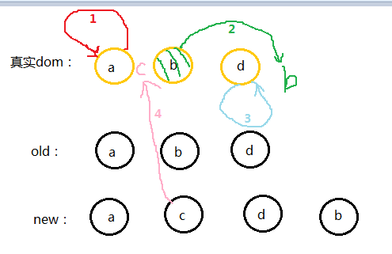

# React

## 说一下React中key的作用
> react中的key是起到一个元素标识的作用，分为两种情况 加key和不加key

**1 加key的情况**

key值应该具有唯一性，一般是后台数据里的每一项的ID,因为在React中，当新老节点在Diff对比中
它会根据key值来进行比较，如果元素存在只是内容变啦。React会改变内容而不是重新创建新的节点
当key值一一对应完 如果没有找到对应的节点 就会创建新的节点 避免啦重复渲染，和创建不必要的节点

**2 不加key的情况**
如果不加key React首先在控制台会给你警告，然后React在Diff对比的过程中就会按照默认的索引值进行一一对比
在对比的过程中如果发现元素不同就会删除重新创建 如果元素位置发生移动 就会造成不必要的节点创建



> 如果加key那么就具有唯一性 在更新的时候 new中的a会去找old中的a 直到发现不存在 才会重新创建
>如果不加key react在进行diff对比的时候就会按照索引值对比 new中的a去和old索引是0的a对比 c和b对比发现不一样
>就会删除原节点重新创建新的节点 以此类推 不一样删除重建 找不到直接创建 所以就造成啦不必要的节点渲染和创建

## 说一下React中的setState
> 首先setState有两个参数 第一个参数是一个对象也可以是一个函数，第二个参数是一个会调函数

**1 第一个参数**

第一个参数 一般我们都会习惯传入一个对象，然后和当前的状态进行合并，然后触发所谓的调和过程
在调和的过程中 首先会进行diff算法的对比并高效的找出新老节点的差异 然后更新改变的部分 也就是按需加载而不是
整个渲染 还有就是 对于第一个参数 最好是传入一个函数而不是一个对象 因为setState是一个异步函数，在多次调用setState
的时候  react出于性能考虑 会把每次的改变放入一个队列中 如果传入的是一个对象 就会造成 多次调用其实就调用啦一次的结果
所以为了避免不必要的错误 我们最好是传入一个函数 函数有两个参数 第一个参数是preState,第二个参数是props。返回一个对象 
在你多次调用setState的时候 前一个状态就会改变 假如是一个计数的动作 那么就是preState+1 

**2 第二个参数**
第二个参数是一个会调函数，假使你第一个参数传入的是一个对象 对于计数的这个动作来说 很可能多次调用发现都是第一个次调用的结果
如果想每次调用都改变 那么就可以把它放到第二个参数里 就是状态改变后才执行的一个回调函数

## addEventListener 第三个参数是啥

> 简单的来说：第三个参数是一个布尔值,true表示事件句柄在捕获阶段执行，false表示事件句柄在冒泡阶段执行(默认为false)

```$xslt
<body>

<p>该实例演示了在添加事件监听时冒泡与捕获阶段的不同。</p>
<div id="myDiv">
	<p id="myP">点击该段落， 我是冒泡</p>
</div><br>
<div id="myDiv2">
	<p id="myP2">点击该段落， 我是捕获</p>
</div>
<script>
document.getElementById("myP").addEventListener("click", function() 
{
    alert("你点击了 P 元素!");
}, false);
document.getElementById("myDiv").addEventListener("click", function()
{
    alert("你点击了 DIV 元素!");
}, false);
document.getElementById("myP2").addEventListener("click", function() 
{
    alert("你点击了 P 元素!");
}, true);
document.getElementById("myDiv2").addEventListener("click", function() 
{
    alert("你点击了 DIV 元素!");
}, true);
</script>

</body>
```
