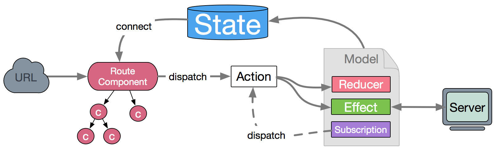

# React

## React中key的作用
> react中的key是起到一个元素标识的作用，分为两种情况 加key和不加key

**1 加key的情况**

key值应该具有唯一性，一般是后台数据里的每一项的ID,因为在React中，当新老节点在Diff对比中
它会根据key值来进行比较，如果元素存在只是内容变啦。React会改变内容而不是重新创建新的节点
当key值一一对应完 如果没有找到对应的节点 就会创建新的节点 避免啦重复渲染，和创建不必要的节点

**2 不加key的情况**
如果不加key React首先在控制台会给你警告，然后React在Diff对比的过程中就会按照默认的索引值进行一一对比
在对比的过程中如果发现元素不同就会删除重新创建 如果元素位置发生移动 就会造成不必要的节点创建


> 如果加key那么就具有唯一性 在更新的时候 new中的a会去找old中的a 直到发现不存在 才会重新创建
>如果不加key react在进行diff对比的时候就会按照索引值对比 new中的a去和old索引是0的a对比 c和b对比发现不一样
>就会删除原节点重新创建新的节点 以此类推 不一样删除重建 找不到直接创建 所以就造成啦不必要的节点渲染和创建

## React中的setState
> 首先setState有两个参数 第一个参数是一个对象也可以是一个函数，第二个参数是一个会调函数

**1 第一个参数**

第一个参数 一般我们都会习惯传入一个对象，然后和当前的状态进行合并，然后触发所谓的调和过程
在调和的过程中 首先会进行diff算法的对比并高效的找出新老节点的差异 然后更新改变的部分 也就是按需加载而不是
整个渲染 还有就是 对于第一个参数 最好是传入一个函数而不是一个对象 因为setState是一个异步函数，在多次调用setState
的时候  react出于性能考虑 会把每次的改变放入一个队列中 如果传入的是一个对象 就会造成 多次调用其实就调用啦一次的结果
所以为了避免不必要的错误 我们最好是传入一个函数 函数有两个参数 第一个参数是preState,第二个参数是props。返回一个对象 
在你多次调用setState的时候 前一个状态就会改变 假如是一个计数的动作 那么就是preState+1 

**2 第二个参数**
第二个参数是一个会调函数，假使你第一个参数传入的是一个对象 对于计数的这个动作来说 很可能多次调用发现都是第一个次调用的结果
如果想每次调用都改变 那么就可以把它放到第二个参数里 就是状态改变后才执行的一个回调函数

## addEventListener 第三个参数是啥

> 简单的来说：第三个参数是一个布尔值,true表示事件句柄在捕获阶段执行，false表示事件句柄在冒泡阶段执行(默认为false)

```$xslt
<body>

<p>该实例演示了在添加事件监听时冒泡与捕获阶段的不同。</p>
<div id="myDiv">
	<p id="myP">点击该段落， 我是冒泡</p>
</div><br>
<div id="myDiv2">
	<p id="myP2">点击该段落， 我是捕获</p>
</div>
<script>
document.getElementById("myP").addEventListener("click", function() 
{
    alert("你点击了 P 元素!");
}, false);
document.getElementById("myDiv").addEventListener("click", function()
{
    alert("你点击了 DIV 元素!");
}, false);
document.getElementById("myP2").addEventListener("click", function() 
{
    alert("你点击了 P 元素!");
}, true);
document.getElementById("myDiv2").addEventListener("click", function() 
{
    alert("你点击了 DIV 元素!");
}, true);
</script>

</body>
```

## 什么是react ?
  react 是facebook 开发的前端JS库。性能出众。不依赖其他的库并可以和其他的库集成。
  它采用jsx的语法 代码结构清晰。它遵循基于组件的方法。有助于构建可重用的UI组件。
  它使用虚拟dom而不是真正的dom。提高应用性能

## react的优点 ？
  1 react采用jsx语法，你可用react-native写ios或者android应用，你也可以用react-native-desktop
  写桌面应用，jsx语法实际在构建一个抽象的视图层   
  2 它采用virtual DOM 减少DOM操作，提高浏览器的渲染性能   
  3 采用单向数据流，使得数据变化可预计，可控制   
  4 采用 immutable object 不可变数据 节约检查消耗
  
  
## 什么是dva ?
1 dva是一个基于redux和redux-sage的数据流方案，内置包含react-router,fetch等，是一个轻量级的应用框架，react技术栈真的很多，dva
就是把这些都集合在一起，形成一定的架构规范    
  

  
**2 数据流向**：输入URL渲染对应的组件，组件dispatch一个action,如果是同步就进入model找到对应的reducer去修改state,如果是异步的话，比如fetch获取后台数据，
就会被Effect拦截，然后流向 Reducers 最终改变 State,state通过connect将model，状态数据和组件相连
  
**3 搭建脚手架：**
```
$ npm install dva-cli -g
$ dva new dva-quickstart

cd dva-quickstart
$ npm start

```
**4 安装antd**
```
 npm install antd babel-plugin-import --save
```
**5 配置antd**
```
// .webpackrc

{
"entry":"src/index.js",
"env": {
    "development": {
      "extraBabelPlugins": [
        ["import", { "libraryName": "antd-mobile","style": true }],
        ["import", {"libraryName": "antd", "libraryDirectory": "es", "style": "css" },""]
      ]
    },
    "production": {
      "extraBabelPlugins": [
        ["import", { "libraryName": "antd-mobile","style": true }],
        ["import", {"libraryName": "antd", "libraryDirectory": "es", "style": "css" },""]
      ]
    }
  }
}

```
**6 配置router.js**
```
import React from 'react';
import { Router, Route, Switch } from 'dva/router';
import dynamic from 'dva/dynamic';
import Navigation from "./components/navigation";
function RouterConfig({history,app}) {
  //登录
  const Login=dynamic({
    app,
    models:()=>[
      import('./models/example')
    ],
    component:()=>import('./routes/Login/Login')
  });

  return(
    <Router history={history}>
      <strong>
        <Switch>
          <Route path='/'  exact component={Login}/>
        </Switch>
        <Navigation/>
      </strong>
    </Router>
  )
}

export default RouterConfig;

```
**7 model**


**7.1 namespace**   
model 的命名空间，同时也是他在全局 state 上的属性，只能用字符串，不支持通过 . 的方式创建多层命名空间。相当于这个model的key
在组件里面，通过connect+这个key将想要引入的model加入   
**7.2 state**   
为状态值的初始值，优先级要低于app.dva({})  
**7.3 reducer**   
Action 处理器，处理同步动作，用来算出最新的 State,同redux中的reducer    
dva对redux做了一层封装，它会把modal里面的 reducers函数, 进行一次key的遍历，每个key为一个reducer,当然它加上命名空间，action type对应的reducer、effect   
**7.4 effect**    
Action 处理器，处理异步动作，基于 Redux-saga 实现。Effect 指的是副作用。根据函数式编程，计算以外的操作都属于 Effect，典型的就是 I/O 操作、数据库读写。以 key/value 格式定义 effect。用于处理异步操作和业务逻辑，不直接修改 state。由 action 触发，可以触发 action，可以和服务器交互，可以获取全局 state 的数据等等   
通过generate yield以及saga里面的常用call、put、takeEvery、takeLatest、take   
call 进行触发异步操作   
put 相当于dispatch 触发reducer改变state   
**7.5 subscriptions**   
以 key/value 格式定义 subscription。subscription 是订阅，用于订阅一个数据源，然后根据需要 dispatch 相应的 action。在 app.start() 时被执行，数据源可以是当前的时间、服务器的 websocket 连接、keyboard 输入、geolocation 变化、history 路由变化等等。   

## 从URL输入到页面展现经历了什么 ?
**用户在浏览器输入URL**    
用户在浏览器地址栏输入地址     

**浏览器根据输入的域名查找对应的IP地址**    
这时候输入的地址域名要进行DNS解析， 
- 首先会查找浏览器缓存 （近期浏览器的网站，浏览器会缓存DNS记录一段时间，如果没有继续向下查找，）  
- 查找系统缓存，（查找C盘下的hosts文件，看看有没有缓存DNS记录，有没有目标域名，如果没有向下查找）  
- 查找路由器有没有缓存DNS记录，如果没有继续向下   
- 查找ISP DNS缓存，（从网络服务商【如：电信】的DNS缓存信息里查找，如果还没继续向下）   
- 查找根域名服务器中URL对应的IP地址，根域名服务器会向下级服务器转达请求，直到找到对应的IP地址为止   
    
****浏览器根据IP地址于服务器建立连接****    
- 浏览器通过 IP 寻址找到了对应的服务器，浏览器就将用户发起的 HTTP 请求发送给服务器。服务器开始处理用户请求，和服务器建立连接，
服务器收到请求后，返回html字符串，浏览器进行解析渲染并最终绘制成网页

- 加载    
浏览器对一个 HTML 页面的加载顺序是从上而下的；
浏览器在加载的过程中，同时进行解析、渲染处理；
在这个过程中，遇到 link 标签、image 标签、script 标签时，浏览器会再次向服务器发送请求以获取相应的 CSS 文件、图片资源、JS 文件，并执行 JS 代码，同步进行加载、解析。    
- 解析/渲染     
解析的过程，其实就是生成“树”（Document Object Model 文档对象模型）；
DOM 树是由 DOM 元素及属性节点组成，并且加上 CSS 解析的样式对象和 JS 解析后的动作实现；
渲染：就是将 DOM 树进行可视化表示。    
- 绘制成网页    
浏览器通过渲染，将 DOM 树可视化，得到渲染树；
构建渲染树使页面以正确的顺序绘制出来，浏览器遵循一定的渲染规则，实现网站页面的绘制，并最终完成页面的展示。
## DOCTYPE有什么作用？怎么写？
DOCTYPE是什么？    
DOCTYPE是document type的简写，它并不是 HTML 标签，也没有结束标签，它是一种标记语言的文档类型声明，
即告诉浏览器当前 HTML 是用什么版本编写的。DOCTYPE的声明必须是 HTML 文档的第一行，位于html标签之前。
大多数Web文档的顶部都有doctype声明，doctype会影响代码验证，并决定了浏览器最终如何显示你的 Web文档。
## 列出常见的标签，并简单介绍这些标签用在什么场景


```
<a> 用于超链接。<a href="">some text</a>
<article> 用于一篇文章。<article>a self-contained article</article>
<aside> 用于页面的侧边栏。<aside>some content</aside>
<blockquote> 用于大段的引用内容。<blockquote>some big texts</blockquote>
<body> 页面上显示的所有内容都被包含在<body></body>里
<br> 用于显示一个换行
<button> 用于显示一个按钮
<code> 用于一包裹一段代码内容
<dd> 用于一个dl列表的某个dt名词的描述
<del> 用于删除一些不需要的文字
<div> 用于包裹住一些其他的标签，制造一个容器
<dl> 用于制作一个名词和对应解释的列表
<dt> 用于一个dl列表的某个dt名词
<em> 用于强调一些文本内容
<figcaption> 用于一张图表的说明文字
<figure> 用于一张图表
<footer> 用于包裹页面的底部内容
<form> 用于制作一个表单
<h1>-<h6> 用于标记标题，从h1到h6重要性依次递减
<head> 用于包裹页面的元数据，如<meta>, <link>, <title>等
<header> 用于包裹页面的头部内容
<hr> 用于制造出一条分隔线
<html> 整个 HTML 文档的根元素，包裹住其他所有的元素
<iframe> 用于嵌入另一个小页面到一个页面中
 用于显示一张图片
<input> 用于显示一个表格输入控件
<label> 用于给一个表格输入控件打上一个标签，说明输入控件的作用
<li> 用于<ul>和<ol>标签，代表一个列表项
<link> 用于链接外部CSS文件
<mark> 用于高亮显示某些文本
<meta> 用于下达一些元数据指令，或者对页面进行说明
<nav> 用于包裹住一个导航条的内容
<ol> 用于制作一个有序列表
<p> 用于显示一个段落
<q> 用于一小段引用文字
<script> 用于一段JavaScript脚本代码，或者引入一个外部JavaScript脚本文件
<section> 用于包裹一部分有逻辑关第的页面内容
<select> 用于制作一个下拉列表选框
<span> 用于包裹住一小段文字，作为一个容器
<strong> 用于着重强调重要的文本内容
<style> 用于给页面元素加上样式
<sub> 用于下标文本
<sup> 用于上标文本
<table> 用于制作一个表格
<tbody> 用于表格里的主体部分
<td> 用于表格里的某一个单元格
<textarea> 用于制作一大块文本输入框
<tfoot> 用于表格里的底部
<th> 用于表格里的表头的单元格
<thead> 用于表格里的表头
<time> 用于页面内容中的时间
<title> 用于显示整个页面的标题（显示在浏览器的tab上）
<tr> 用于标记表格里的一行
<ul> 用于制作一个无序列表
```
## img标签的alt和title有什么作用？
alt 指图片无法加载的时候，显示出alt里的内容   
title 指你鼠标悬停在图片上会显示的内容    
## javaScript中的'use strict' 什么意思？它的限制是什么？
`use strict` 表示以下代码将执行严格模式，代码更加严谨。安全  
- 限制    
1 变量必须声明后才能使用   
2 函数的参数不能有同名属性，否则报错   
3 禁止this指向全局对象   

设立"严格模式"的目的，主要有以下几个：   
消除Javascript语法的一些不合理、不严谨之处，减少一些怪异行为;  
消除代码运行的一些不安全之处，保证代码运行的安全；  
提高编译器效率，增加运行速度；  