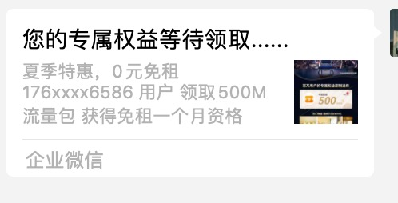
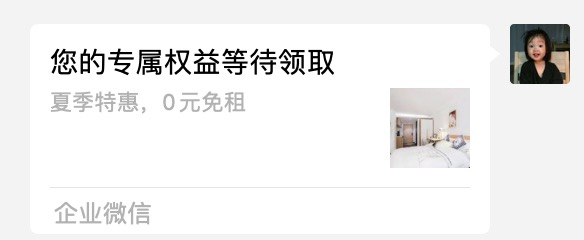

# 企业微信 h5 页面分享功能

- 需求：
  老板说要把做的落地页在企业微信浏览器打开分享出去要修改卡片显示的内容

* 默认显示的是这样：



#### 调用企业微信 sdk 实现 h5 分享功能

- 官方 api : https://open.work.weixin.qq.com/api/doc/90000/90136/90512
  > 我的需求只是修改分享卡片的内容

详细过程如下：

###### 第一步 `获取企业ID`

- 1 在企业微信分享你必须有企业的管理员登录企微后台找到企业 id
  > 登录企业微信后台 -> 点击我的企业 -> 最下面会显示企业 ID

###### 第二步 `获取Secret`

> 点击应用管理 -> 创建自建应用 -> 拿到 Secret

###### 接下来就是写前端代码：

```js
<script src="https://res.wx.qq.com/open/js/jweixin-1.2.0.js"></script>
<script src='./axios.min.js'></script>
<script>

    let loadFunc = async () => {
        // let url = 'http://localhost:3008/weixinrandom';
        const returnData = await axios.get(url).then(res => {
            return res.data;
        });

        wx.config({
            beta: true,// 必须这么写，否则wx.invoke调用形式的jsapi会有问题
            debug: false, // 开启调试模式,调用的所有api的返回值会在客户端alert出来，若要查看传入的参数，可以在pc端打开，参数信息会通过log打出，仅在pc端时才会打印。
            appId: '', // 必填，企业微信的corpID
            timestamp: returnData.timestamp, // 必填，生成签名的时间戳
            nonceStr: returnData.noncestr, // 必填，生成签名的随机串
            signature: returnData.signature,// 必填，签名，见 附录-JS-SDK使用权限签名算法
            jsApiList: ['invoke', 'onMenuShareAppMessage', 'onMenuShareWechat'] // 必填，需要使用的JS接口列表，凡是要调用的接口都需要传进来
        });


        wx.ready(function () {
            // config信息验证后会执行ready方法，所有接口调用都必须在config接口获得结果之后，config是一个客户端的异步操作，所以如果需要在页面加载时就调用相关接口，则须把相关接口放在ready函数中调用来确保正确执行。对于用户触发时才调用的接口，则可以直接调用，不需要放在ready函数中。
            console.log('success?')

            // 自定义转发到会话   打开之后 进页面就调取企微会话列表
            // wx.invoke(
            //     "shareAppMessage", {
            //     title: 's转发标题', // 分享标题
            //     desc: 's转发描述', // 分享描述
            //     link: 's转发链接', // 分享链接
            //     imgUrl: './001.jpg' // 分享封面
            // }, function (res) {
            //     if (res.err_msg == "shareAppMessage:ok") {
            //         console.log('ok')
            //     }
            // }
            // );

            // 打开之后 进页面就调取分享好友列表
            // wx.invoke(
            //     "shareWechatMessage", {
            //     title: 's微信分享标题', // 分享标题
            //     desc: 's微信分享描述', // 分享描述
            //     link: '', // 分享链接
            //     imgUrl: '' // 分享封面
            // }, function (res) {
            //     if (res.err_msg == "shareWechatMessage:ok") {
            //         console.log('oks')
            //     }
            // }
            // );


            //自定义转发
            wx.onMenuShareAppMessage({
                title: '您的专属权益等待领取', // 分享标题
                desc: '夏季特惠，0元免租', // 分享描述
                link: 'localshopcardh5.chrtest.index8.cn',// 分享链接；在微信上分享时，该链接的域名必须与企业某个应用的可信域名一致
                imgUrl: 'http://localshopcardh5.chrtest.index8.cn/card2.jpg', // 分享图标  不支持svg 切记 这是地址是线上的完整地址
                success: function () {
                    // 用户确认分享后执行的回调函数
                    console.log('分享成功')
                },
                cancel: function () {
                    // 用户取消分享后执行的回调函数
                    console.log('分享失败')
                }
            });

            // try

            // wx.onMenuShareWechat({
            //     title: '123', // 分享标题
            //     desc: '24', // 分享描述
            //     link: '', // 分享链接
            //     imgUrl: 'http://localshopcardh5.chrtest.index8.cn/6.jpg', // 分享图标
            //     success: function () {
            //         // 用户确认分享后执行的回调函数
            //     },
            //     cancel: function () {
            //         // 用户取消分享后执行的回调函数
            //     }
            // });
        });

        wx.error(function (res) {
            // config信息验证失败会执行error函数，如签名过期导致验证失败，具体错误信息可以打开config的debug模式查看，也可以在返回的res参数中查看，对于SPA可以在这里更新签名。
            console.log(res, 'error?')
        });
    }
    loadFunc();
</script>
```

###### 接下来是后端代码：
```js
// 因为要用sha1加签名
const { createHash } = require('crypto'); 
const encrypt = (algorithm, content) => {
    let hash = createHash(algorithm)
    hash.update(content)
    return hash.digest('hex')
}

//这个是生成随机数的函数
const numberConvertEnglishLettersMap = () => {
    return [
        { 'key': 10, 'value': 'a' },
        { 'key': 11, 'value': 'b' },
        { 'key': 12, 'value': 'c' },
        { 'key': 13, 'value': 'd' },
        { 'key': 14, 'value': 'e' },
        { 'key': 15, 'value': 'f' },
        { 'key': 16, 'value': 'g' },
        { 'key': 17, 'value': 'h' },
        { 'key': 18, 'value': 'i' },
        { 'key': 19, 'value': 'j' },
        { 'key': 20, 'value': 'k' },
        { 'key': 21, 'value': 'l' },
        { 'key': 22, 'value': 'm' },
        { 'key': 23, 'value': 'n' },
        { 'key': 24, 'value': 'o' },
        { 'key': 25, 'value': 'p' },
        { 'key': 26, 'value': 'q' },
        { 'key': 27, 'value': 'r' },
        { 'key': 28, 'value': 's' },
        { 'key': 29, 'value': 't' },
        { 'key': 30, 'value': 'u' },
        { 'key': 31, 'value': 'v' },
        { 'key': 32, 'value': 'w' },
        { 'key': 33, 'value': 'x' },
        { 'key': 34, 'value': 'y' },
        { 'key': 35, 'value': 'z' },
    ];
}


exports.weixinRandomApi = async (req, h) => {
    // url = referrer 这个是生成签名的url 其实就是你的落地页链接
    const { referrer } = req.info;
    //1 生成随机字符串
    let numberConvertEnglishLetters = (number) => {
        let map = numberConvertEnglishLettersMap();
        for (let i = 0; i < map.length; i++) {
            if (map[i].key == number) {
                return map[i].value;
            }
        }
    }
    // 生成随机字符串 nonceStr
    let generateRandomNumbers = (total) => {
        let that = this;
        // 如果不传total或者传0，设置成10位。
        total = total == undefined || total == 0 ? 10 : total;
        let str = '';
        for (let i = 0; i < total; i++) {
            let number = parseInt(Math.random() * 35);
            // 当前生成的随机数大于等于10则进行转换。
            if (number >= 10) {
                str += numberConvertEnglishLetters(number);
            } else {
                str += number.toString();
            }
        }
        return str;
    }
    //2 生成随机数  timestamp
    const randomNum = (len) => {
        let str = '';
        for (let i = 0; i < len; i++) {
            let num = parseInt(Math.random() * 10);
            str += num;
        }
        return Number(str);
    }
    const timestamp = randomNum(10);
    const noncestr = generateRandomNumbers(16);
    const corpid = "";
    const Secret = "";
    //1 获取 access_token
    const access_token = await axios.get(`https://qyapi.weixin.qq.com/cgi-bin/gettoken?corpid=${corpid}&corpsecret=${Secret}`).then(res => {
        //  console.log(res.data,'ok')
        return res.data.access_token;
    });
    //传入 access_token 获取 ticket
    if (access_token) {
        const ticket = await axios.get(`https://qyapi.weixin.qq.com/cgi-bin/get_jsapi_ticket?access_token=${access_token}`).then(res => {
            // console.log(res.data.ticket, '123213')
            return res.data.ticket;
        })
        console.log(ticket, '???')
        let sign = `jsapi_ticket=${ticket}&noncestr=${noncestr}&timestamp=${timestamp}&url=${referrer}`
        //进行sha1 加签
        const sha1 = (content) => encrypt('sha1', content);
        // console.log(sha1(sign), '生成的签名')
        const signature = sha1(sign);

        return {
            timestamp, //必填，生成签名的时间戳
            noncestr,//必填，生成签名的随机串
            // ticket, // jsapi_ticket
            signature //签名
        }
    }
    return { error: "服务内部错误" }
}

```
-  最后 放到线上的时候 在企微浏览器打开落地页链接 分享给微信好友 分享卡片内容就修改成功了



